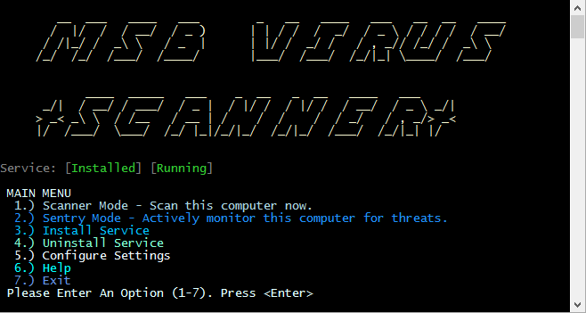

# MSB Virus Scanner

A simple Windows utility for detecting Crypto/Ransomware Viruses

## Operation
* Scanner Mode - Scans local and removable drives for files matching patterns known to be associated with crypto viruses.  
 * Automatically includes patterns from https://fsrm.experiant.ca/api/v1/combined.
 * Optionally specify your own list of patterns to scan for
 * Whitelist patterns to avoid false positives
* Sentry Mode - Monitors local drives for infected files
 * File Creation Events - Files are automatically scanned 
 * File Rename Events - Files are automatically scanned
* Service Mode - Install as a Windows Service
 * Runs Sentry Mode continuously
 * Runs a full scan daily 
* Debug Mode (All Modes)
 * Only sends alerts to debug user
 * Disables mitigation actions
 * Does not notify user of infection
* Mitigate (All Modes) - Take specified action(s) when an infected files is found
 * Alerts user of the infection
 * Optionally disables network connections
 * Optionally shuts down infected computer
* Notify (All Modes) - Alert Service Desk or others
 * Send email notification (optional)
 * Send Slack notification (optional)
* Log (All Modes) - Logs Activity
 * Log to text file (Scanner Mode)
 * Log to Windows Event Log
 * Log to SQL Database (optional)

## Command Line Operation

View the command line instructions by choosing option 6 at the Main Menu.

## Configuration

Configure the application by choosing option 5 at the Main Menu. You can also edit the .config file directly.

 

## Contributing
 I'm always open to suggestions. Send me a PR or open an issue with GitHub.

## Credits
 Thank you to https://fsrm.experiant.ca for providing the API.
 
## Author
 J. Bloomstrom

## License
 MIT

 The MIT License (MIT)
Copyright (c) 2016 Matanuska-Susitna Borough

Permission is hereby granted, free of charge, to any person obtaining a copy of this software and associated documentation files (the "Software"), to deal in the Software without restriction, including without limitation the rights to use, copy, modify, merge, publish, distribute, sublicense, and/or sell copies of the Software, and to permit persons to whom the Software is furnished to do so, subject to the following conditions:

The above copyright notice and this permission notice shall be included in all copies or substantial portions of the Software.

THE SOFTWARE IS PROVIDED "AS IS", WITHOUT WARRANTY OF ANY KIND, EXPRESS OR IMPLIED, INCLUDING BUT NOT LIMITED TO THE WARRANTIES OF MERCHANTABILITY, FITNESS FOR A PARTICULAR PURPOSE AND NONINFRINGEMENT. IN NO EVENT SHALL THE AUTHORS OR COPYRIGHT HOLDERS BE LIABLE FOR ANY CLAIM, DAMAGES OR OTHER LIABILITY, WHETHER IN AN ACTION OF CONTRACT, TORT OR OTHERWISE, ARISING FROM, OUT OF OR IN CONNECTION WITH THE SOFTWARE OR THE USE OR OTHER DEALINGS IN THE SOFTWARE.
 
 